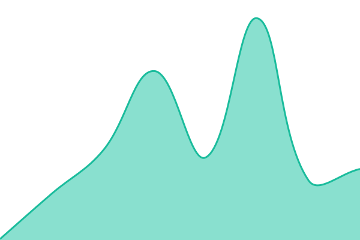
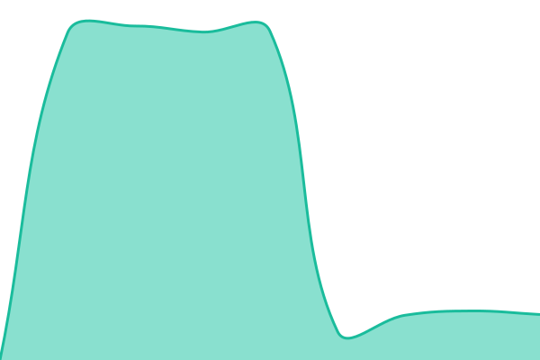

# [📈 Live Status](https://ACTS-HORIZON.github.io/status-page): <!--live status--> **🟧 Partial outage**

This repository contains the open-source uptime monitor and status page for [ACTS-HORIZON](https://ACTS-HORIZON.github.io/status-page), powered by [Upptime](https://github.com/upptime/upptime).

With [Upptime](https://upptime.js.org), you can get your own unlimited and free uptime monitor and status page, powered entirely by a GitHub repository. We use [Issues](https://github.com/ACTS-HORIZON/status-page/issues) as incident reports, [Actions](https://github.com/ACTS-HORIZON/status-page/actions) as uptime monitors, and [Pages](https://ACTS-HORIZON.github.io/status-page) for the status page.

<!--start: status pages-->
<!-- This summary is generated by Upptime (https://github.com/upptime/upptime) -->
<!-- Do not edit this manually, your changes will be overwritten -->
<!-- prettier-ignore -->
| URL | Status | History | Response Time | Uptime |
| --- | ------ | ------- | ------------- | ------ |
|  [Plex Auth](https://app.plex.tv/auth) | 🟩 Up | [plex-auth.yml](https://github.com/ACTS-HORIZON/status-page/commits/HEAD/history/plex-auth.yml) | 

 106ms
     
 | 

<a href="https://ACTS-HORIZON.github.io/status-page/history/plex-auth">100.00%</a>
    

|  [Plex](https://acts-horizon.com) | 🟩 Up | [plex.yml](https://github.com/ACTS-HORIZON/status-page/commits/HEAD/history/plex.yml) | 

 215ms
     
 | 

<a href="https://ACTS-HORIZON.github.io/status-page/history/plex">98.57%</a>
    

|  [Jellyfin](https://jellyfin.acts-horizon.com) | 🟥 Down | [jellyfin.yml](https://github.com/ACTS-HORIZON/status-page/commits/HEAD/history/jellyfin.yml) | 

 2403ms
     
 | 

<a href="https://ACTS-HORIZON.github.io/status-page/history/jellyfin">40.16%</a>
    

|  [Overseerr](https://request.acts-horizon.com) | 🟥 Down | [overseerr.yml](https://github.com/ACTS-HORIZON/status-page/commits/HEAD/history/overseerr.yml) | 

 3185ms
     
 | 

<a href="https://ACTS-HORIZON.github.io/status-page/history/overseerr">0.00%</a>
    

<!--end: status pages-->

[**Visit our status website →**](https://ACTS-HORIZON.github.io/status-page)

## 📄 License

- Powered by: [Upptime](https://github.com/upptime/upptime)
- Code: [MIT](./LICENSE) © [Anand Chowdhary](https://anandchowdhary.com), supported by [Pabio](https://pabio.com)
- Data in the `./history` directory: [Open Database License](https://opendatacommons.org/licenses/odbl/1-0/)
